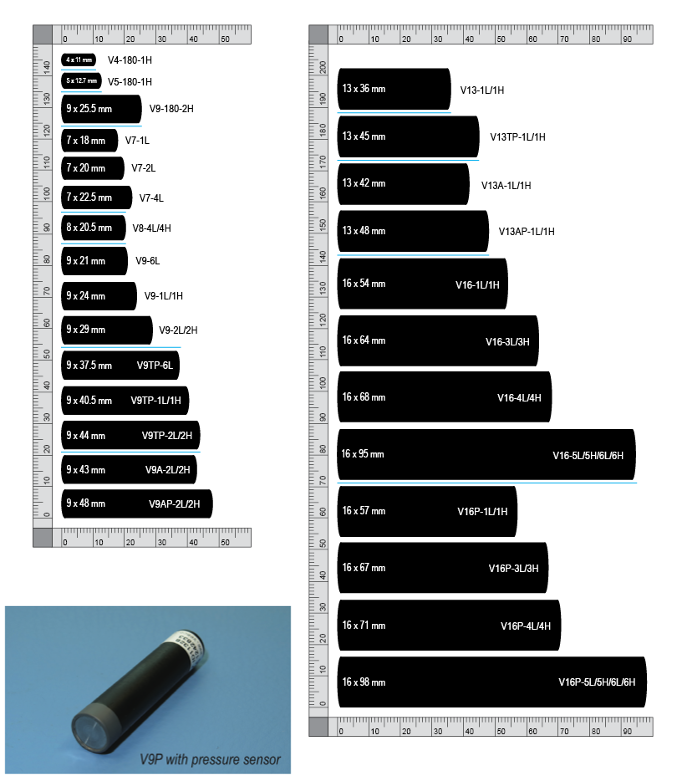
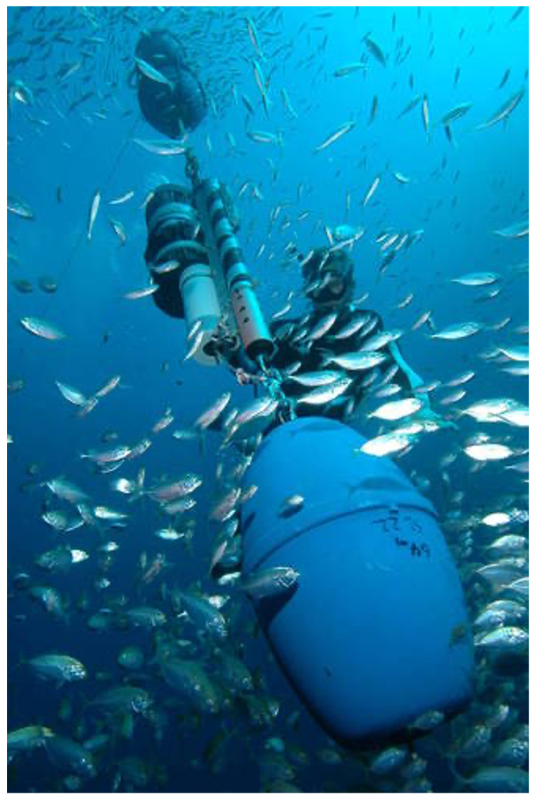
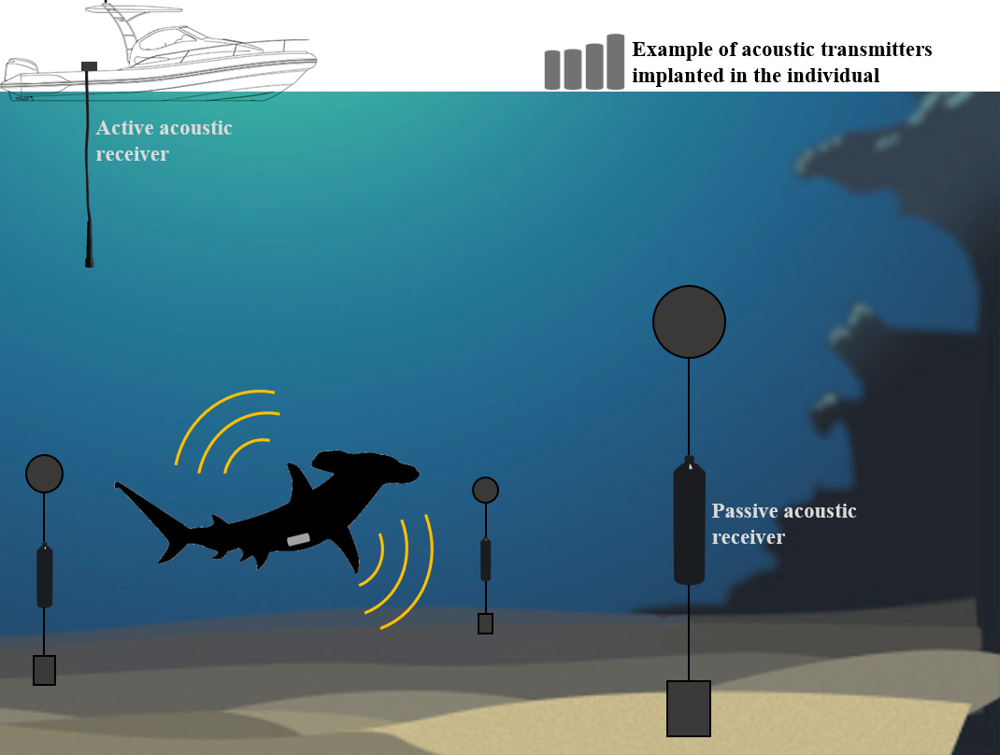

--------------------------------------

# What is Acoustic telemetry?


<br>

Acoustic telemetry refers to tracking the movements of aquatic animals using active transmission of sound pulses as an encoded signal. Typically, it involves the use of a specialised transmitter attached to an animal to be tracked, and recording its presence at key locations and habitats via an array of omnidirectional hydrophones in fixed locations within the study site.

Acoustic Telemetry makes it possible for multiple animals to be monitored over long periods of time, and over scales of 100s of metres to 100s of kilometres. Information obtained from acoustic telemetry can informing habitat use, home range size, effectiveness of marine protected areas, refinement of stock assessment and migratory patterns. 


<br>


---------------------------------------

## A two-part system {.tabset .tabset-fade .tabset-pills}

### Acoustic transmitters

:::: {style="display: grid; grid-template-columns: 1fr 1fr; grid-column-gap: 40px;"}

::: {}
And this block will be put on the left:

Text

<br><br><br><br>

:::

::: {}



:::

::::

<br><br><br><br>

### Acoustic Receivers

:::: {style="display: grid; grid-template-columns: 1fr 2fr; grid-column-gap: 40px;"}

::: {}

:::

::: {}
And this block will be put on the right:

Text

<br><br><br><br>

:::

::::

<br><br><br><br>

---------------------------------------

## Active vs Passive tracking

Acoustic telemetry has been successfully implemented on an incredibly diverse range of species. Acoustic telemetry includes both passive acoustic telemetry where a network of static receivers detects animals moving through their environment, and active acoustic tracking where an individual animal is followed around by a small boat with a mobile receiver attached. Here, we only discuss the former as it comprises the overwhelming majority of acoustic telemetry research outputs. 

<br><br><br>




<br><br>

Check out the [Innovasea support webpage](https://support.vemco.com/s/topic/0TO2M000001I4G2WAK/acoustic-telemetry-101?tabset-c9027=2) for more information on basic concepts, tips on study design and technical specifications of transmitters and receivers. 

<br><br><br><br>

---------------------------------------

## The National network and benifits of Data Sharing


By its very nature acoustic telemetry is almost pre-destined for large scale collaboration and data sharing. Animals tagged in one project’s array are likely to leave the area covered by those receivers unless it is very extensive or they have extremely small home ranges.

The IMOS Animal Tracking Database provides a central repository of acoustic tag detections and metadata from Australia, increasing collaboration of acoustic telemetry researchers and institutes and increased access to animal movement data ([Hoenner et al. 2018](https://www.nature.com/articles/sdata2017206)). 

Historically, the ability to track the movements of animals has primarily relied upon the recapture and reporting of tagged individuals at both small and large scales. The use of a network of acoustic receivers that allow the detection of tagged animals in near real-time provides a powerful tool for observing animal movements in Australian coastal and continental shelf ecosystems.

Acoustic Telemetry uses a large network of strategically located acoustic receivers in waters around Australia to detect and track tagged animals. This network typically consists of two main types of deployments, large cross shelf arrays or curtains and clustered arrays around local areas such as reefs, headlands, and estuaries. Historically, the ability to track the movements of animals has primarily relied upon the recapture and reporting of tagged individuals at both small and large scales. The use of a network of acoustic receivers that allow the detection of tagged animals in near real-time provides a powerful tool for observing animal movements in Australian coastal and continental shelf ecosystems.


<br><br>

Here is an examples of how this national network can be used to better understand the long-distance migrations and movements of some of the marine fauna in Australia ([Espinoza et al. 2016](https://journals.plos.org/plosone/article?id=10.1371/journal.pone.0147608))

<br>

```{r, echo=FALSE, message=FALSE, warning=FALSE}
library(vembedr)
vembedr::embed_youtube(id = "BTEHiihib8g", allowfullscreen = T) %>%
  vembedr::use_bs_responsive()

vembedr::embed_youtube(id = "f2W6Aq6epTI", allowfullscreen = T) %>%
  vembedr::use_bs_responsive()

```

--------------------------------------


<br><br><br>


If you have any comments or queries about the IMOS Animal Tracking Database free to contact us at:

* IMOS Animal Tracking Facility: <...>

**Happy Tracking!**

<br><br><br><br>

---------------------------------------

**Vignette version**
0.0.1 (8 Dec 2020)
