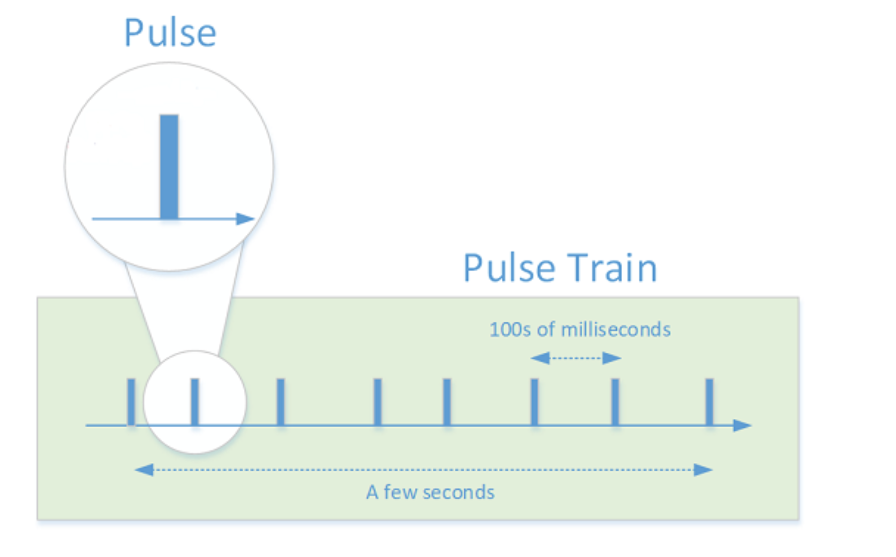
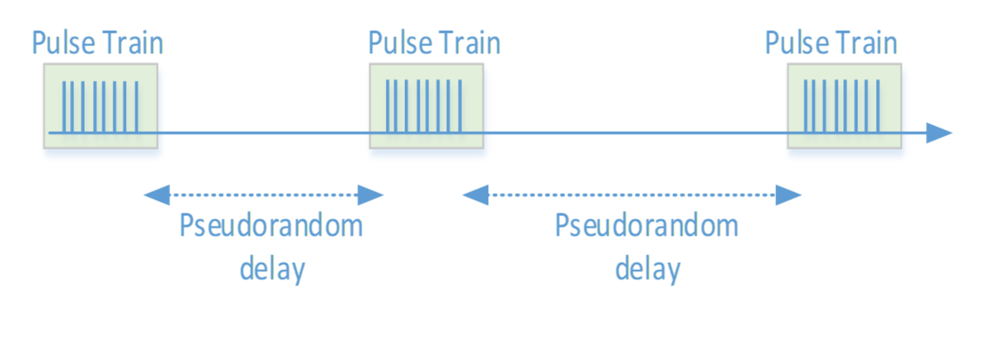
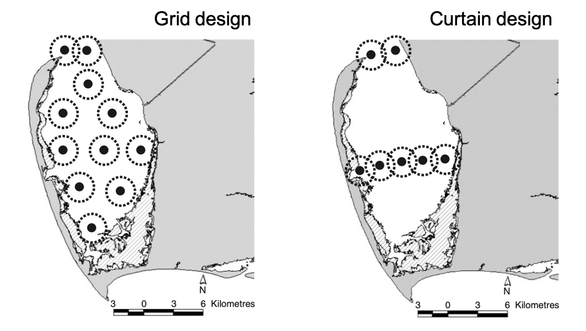

--------------------------------------

# What is Acoustic telemetry?


<br>

Acoustic telemetry refers to tracking the movements of aquatic animals using active transmission of sound pulses as an encoded signal. Typically, it involves the use of a specialised transmitter attached to an animal to be tracked, and recording its presence at key locations and habitats via an array of omnidirectional hydrophones in fixed locations within the study site.

Acoustic Telemetry makes it possible for multiple animals to be monitored over long periods of time, and over scales of 100s of metres to 100s of kilometres. Information obtained from acoustic telemetry can informing habitat use, home range size, effectiveness of marine protected areas, refinement of stock assessment and migratory patterns. 


<br>


---------------------------------------

## A two-part system {.tabset .tabset-fade .tabset-pills}

### Acoustic transmitters


:::: {style="display: grid; grid-template-columns: 1fr 1fr; grid-column-gap: 40px;"}

::: {}

<br>

Tracking the movement of animals involves affixing special tags to individuals that are being monitored. These tags, called acoustic transmitters, transmit high frequency acoustic signals that include a unique animal ID. Transmitters with sensors also transmit sensor data that may include temperature, pressure (depth) or acceleration data. Long-term passive monitoring primarily uses coded tags that use a communication system called Pulse Position Modulation (PPM). This system works where tags transmit a sequence of 8 to 10 coded pulses, called a 'Pulse Train'.

<br>

 

<br>

A pulse train takes 3 - 5 seconds to transmit, and is transmitted repeatedly with a delay over the life of the tag. The delay between pulse trains can be fixed or pseudorandom, with the latter allowing multiple tags to operate simultaneously without collision of signals between different tagged individuals. 

<br>




<br><br>

:::

::: {}

<br><br>
<br><br>


:::

::::

<br><br>

### Acoustic Receivers


:::: {style="display: grid; grid-template-columns: 1fr 2fr; grid-column-gap: 40px;"}

::: {}

<br><br>
<br><br>


:::

::: {}

<br>

The second part of this system are hydrophone data loggers called 'acoustic receivers'. These receivers record the unique animal ID, any sensor data and a timestamp when an animal fitted with an acoustic transmitter is within detection range of a receiver. The detection range of a receiver depends on a range of factors depending on the study site. More information on detection range can be found [here](https://support.vemco.com/s/article/How-much-detection-range-can-I-expect-from-my-tags-and-receivers).

<br>

In most cases, multiple receivers (termed an 'array') are deployed at fixed locations around a study site, for the full period of the study (i.e., seasons, years), and allow for long-term continuous monitoring. The design of the receiver array depends on the question being explored, the animals being tracked or the habitats within the study site. [Heupel et al. 2006](https://doi.org/10.1071/MF05091) provides a good review of possible designs of acoustic arrays, including grids and curtains, to track marine animals.

<br>




<br><br>

:::

::::

<br><br>

---------------------------------------

## Active vs Passive tracking

Acoustic telemetry has been successfully implemented on an incredibly diverse range of species. Acoustic telemetry includes both passive acoustic telemetry where a network of static receivers detects animals moving through their environment, and active acoustic tracking where an individual animal is followed around by a small boat with a mobile receiver attached. Researchers working with the IMOS Animal Tracking Facility use a combination of both to collect data on a range of marine species.

<br><br>


<br><br>

Check out the [Innovasea support webpage](https://support.vemco.com/s/topic/0TO2M000001I4G2WAK/acoustic-telemetry-101?tabset-c9027=2) for more information on basic concepts, tips on study design and technical specifications of transmitters and receivers. 

<br><br>

---------------------------------------

## The National Network 

By its very nature acoustic telemetry is almost pre-destined for large scale collaboration and data sharing. Animals tagged in one project’s array are likely to leave the area covered by those receivers unless it is very extensive or they have extremely small home ranges.

The IMOS Animal Tracking Database provides a central repository of acoustic tag detections and metadata from Australia, increasing collaboration of acoustic telemetry researchers and institutes and increased access to animal movement data ([Hoenner et al. 2018](https://www.nature.com/articles/sdata2017206)). 

Historically, the ability to track the movements of animals has primarily relied upon the recapture and reporting of tagged individuals at both small and large scales. The use of a network of acoustic receivers that allow the detection of tagged animals in near real-time provides a powerful tool for observing animal movements in Australian coastal and continental shelf ecosystems.

Acoustic Telemetry uses a large network of strategically located acoustic receivers in waters around Australia to detect and track tagged animals. This network typically consists of two main types of deployments, large cross shelf arrays or curtains and clustered arrays around local areas such as reefs, headlands, and estuaries. Historically, the ability to track the movements of animals has primarily relied upon the recapture and reporting of tagged individuals at both small and large scales. The use of a network of acoustic receivers that allow the detection of tagged animals in near real-time provides a powerful tool for observing animal movements in Australian coastal and continental shelf ecosystems.

<br><br>

```{r, echo=FALSE, message=FALSE, warning=FALSE, out.width='100%'}
library(mapview)
library(tidyverse)
library(sf)
library(lubridate)
library(leafem)

mapviewOptions(fgb = F)

statinfo <-
  read_csv("data/IMOS-ATF_Receiver-Deployment-Metadata_ALL.csv") %>% 
  mutate(deployment_latitude = case_when(deployment_latitude > 0 ~ -deployment_latitude, TRUE ~ deployment_latitude)) %>% 
  filter(recovery_date > (ymd_hms(Sys.time()) - years(1) - months(6))) %>% 
  mutate(imos_device = case_when(str_detect(project_operatedby, pattern = "IMOS") ~ "IMOS", TRUE ~ "Independent")) %>% 
  select(deployment_longitude, deployment_latitude, imos_device, installation_name, station_name) %>% 
  st_as_sf(coords = c("deployment_longitude", "deployment_latitude"), crs = 4326)


mapview(statinfo, zcol = "imos_device", burst = T, map.type = c("Esri.WorldImagery", "OpenStreetMap"), 
        legend = F, homebutton = F)@map %>% 
  leafem::removeMouseCoordinates() 
  

```

<br><br>

Here is an examples of how this national network can be used to better understand the long-distance migrations and movements of some of the marine fauna in Australia ([Espinoza et al. 2016](https://journals.plos.org/plosone/article?id=10.1371/journal.pone.0147608))

<br>

```{r, echo=FALSE, message=FALSE, warning=FALSE}
library(vembedr)
vembedr::embed_youtube(id = "BTEHiihib8g", allowfullscreen = T) %>%
  vembedr::use_bs_responsive()

vembedr::embed_youtube(id = "f2W6Aq6epTI", allowfullscreen = T) %>%
  vembedr::use_bs_responsive()

```

<br><br>

--------------------------------------


If you have any comments or queries about the IMOS Animal Tracking Database contact the IMOS Animal Tracking Facility team at <info@aodn.org.au>.

**Happy Tracking!**


---------------------------------------

**Vignette version**
0.0.2 (22 Jan 2021)


<div class="tocify-extend-page" data-unique="tocify-extend-page" style="height: 0;"></div>


