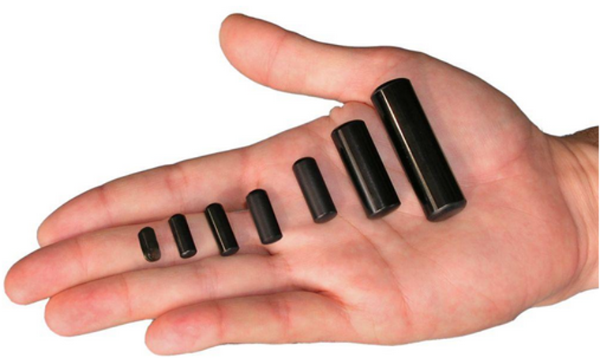
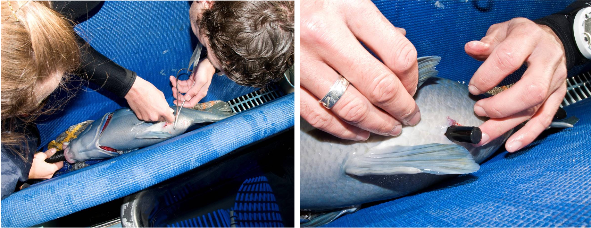
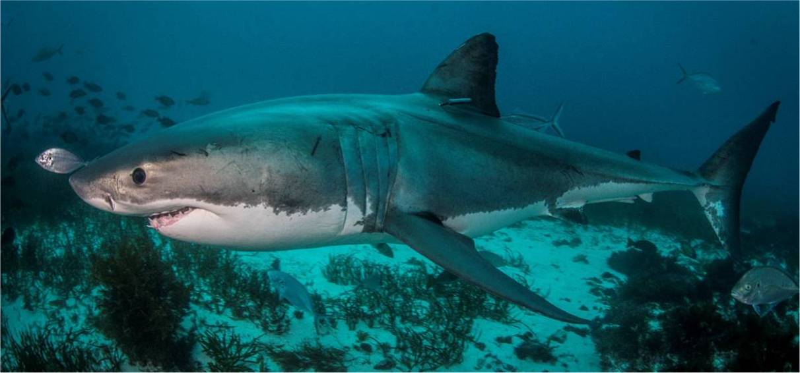
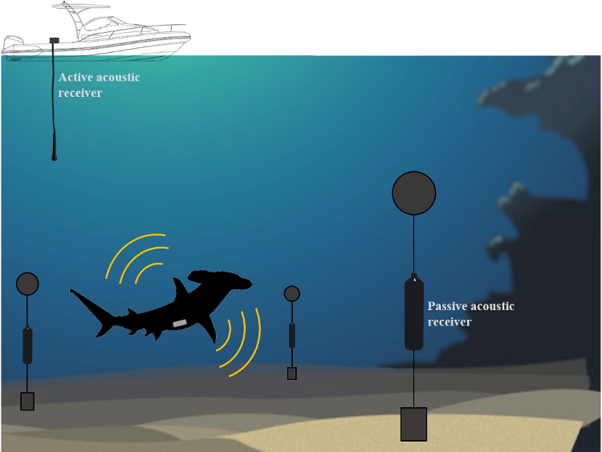

--------------------------------------

# What is Acoustic Telemetry?


<br>

Acoustic telemetry refers to tracking the movements of aquatic animals using high frequency sound pulses as an encoded signal. It typically involves two pieces of equipment: 1) a transmitter or tag attached to the animal to be tracked, and 2) a receiver or listening station deployed at key locations and habitats, which records the presence of the tagged animal whenever it is within range (~200 – 800 m in most cases). 

Acoustic Telemetry makes it possible for multiple animals to be monitored over long periods of time, and over scales of 100s of metres to 100s of kilometres. Information obtained from acoustic telemetry can inform habitat use, home range size, effectiveness of marine protected areas, refinement of stock assessment, and migratory patterns.

<br>


---------------------------------------

## A two-part system {.tabset .tabset-fade .tabset-pills}

### Acoustic transmitters


<br>

Tracking the movement of animals involves affixing special tags to individuals that are being monitored. These tags, called acoustic transmitters, transmit high frequency acoustic signals that include a unique animal ID. Transmitters with sensors also transmit sensor data that may include temperature, pressure (depth) or acceleration. Long-term passive monitoring primarily uses coded tags that use a communication system called Pulse Position Modulation (PPM). This system works where tags transmit a sequence of coded pulses.

<br>

:::: {style="display: grid; grid-template-columns: 1.5fr 1fr; grid-column-gap: 50px;"}

::: {}

<br><br>

Acoustic transmitters have been developed and commercially produced by a number of manufacturers. The IMOS Animal Tracking Facility utilises tracking technology primarily from [Innovasea](https://www.innovasea.com/fish-tracking/), however can support data obtained from a range of other systems. Transmitters developed by Innovasea range in size from 15 - 98mm, with the largest tags having a battery life of 10 years. 

:::

::: {}

<br>

 

<br><br>

:::

::::


Depending on the size, shape and behaviour of the study species, transmitters can be attached to individuals by conducting a minor surgical procedure.   

<br> 

 

<br><br>

Larger animals, or animals difficult to handle can also be tagged externamlly using transmitters tethered to specialised dart tags. 


 

<br><br>

### Acoustic Receivers


:::: {style="display: grid; grid-template-columns: 1fr 2fr; grid-column-gap: 40px;"}

::: {}

<br><br>
<br><br>


:::

::: {}

<br>

The second part of this system are hydrophone data loggers called ‘acoustic receivers' or 'listening stations’. These receivers record the unique animal ID transmitted by the tag, any sensor data and a timestamp when a tagged animal fitted is within detection range of a receiver. The detection range of a receiver depends on a range of factors, that can vary through time and depending on the deployment location. More information on detection range can be found  [here](https://support.vemco.com/s/article/How-much-detection-range-can-I-expect-from-my-tags-and-receivers) and [here](https://doi.org/10.1111/2041-210X.12520).

<br>

In most cases, multiple receivers (termed an ‘array’) are deployed at fixed locations around a study site, for the full period of the study (i.e., seasons, years), and allow for long-term continuous monitoring. The design of the receiver array depends on the question being explored, the animals being tracked, or the habitats within the study site. [Heupel et al. 2006](https://doi.org/10.1071/MF05091) provides a good review of possible designs of acoustic arrays, including grids and curtains, to track marine animals.

<br>


<br><br>

:::

::::

<br><br>

---------------------------------------

## Active vs Passive tracking

Acoustic telemetry has been successfully implemented on an incredibly diverse range of species and for diverse objectives ([Brodie et al., 2018 ](https://doi.org/10.1038/s41598-018-21988-5), [Huveneers et al., 2021](https://doi.org/10.1016/j.biocon.2021.108995)). Acoustic telemetry includes both passive acoustic telemetry where a network of static receivers detects animals moving through their environment, and active acoustic tracking where an individual animal is followed by a boat with a mobile receiver.

<br><br>



<br><br>

Check out the [Innovasea support webpage](https://support.vemco.com/s/topic/0TO2M000001I4G2WAK/acoustic-telemetry-101?tabset-c9027=2) for more information on basic concepts, tips on study design and technical specifications of transmitters and receivers. 

<br><br>

---------------------------------------

## The National Network 

By its very nature, acoustic telemetry is almost pre-destined for large-scale collaboration and data sharing. Tagged animals often leave the study site unless it covers a large area or the tagged animals have extremely small home ranges.

The IMOS Animal Tracking Database provides a central repository of acoustic tag detections and metadata from Australia, increasing collaboration of acoustic telemetry researchers and institutes and increased access to animal movement data ([Hoenner et al. 2018](https://www.nature.com/articles/sdata2017206)).

Acoustic Telemetry uses a large network of strategically located acoustic receivers in waters around Australia to detect and track tagged animals. This network typically consists of two main types of deployments, large cross-shelf arrays or curtains and clustered arrays around local areas such as reefs, headlands, and estuaries. Historically, the ability to track the movements of animals has primarily relied upon the recapture and reporting of tagged individuals at both small and large scales. The use of a network of acoustic receivers that allow the detection of tagged animals in near real-time provides a powerful tool for observing animal movements in Australian coastal and continental shelf ecosystems.

<br><br>

Here is an examples of how this network has been used by the New South Wales Department of Primary Industry to monitor the movements of sharks across Australia.

<br>

```{r, echo=FALSE, message=FALSE, warning=FALSE}
library(vembedr)
embed_youtube("2mhisuvONg8", allowfullscreen = T) %>%
  use_bs_responsive() %>%
  use_align("center")
```

<br><br>


--------------------------------------


If you have any comments or queries about the IMOS Animal Tracking Database contact:

- The Australian Ocean Data Network at <info@aodn.org.au>

- The IMOS Animal Tracking Facility at <IMOS.AnimalTrackingFacility@sims.org.au>

<br>

**Happy Tracking!**


---------------------------------------

**Vignette version**
0.0.3 (10 Feb 2021)


<div class="tocify-extend-page" data-unique="tocify-extend-page" style="height: 0;"></div>


